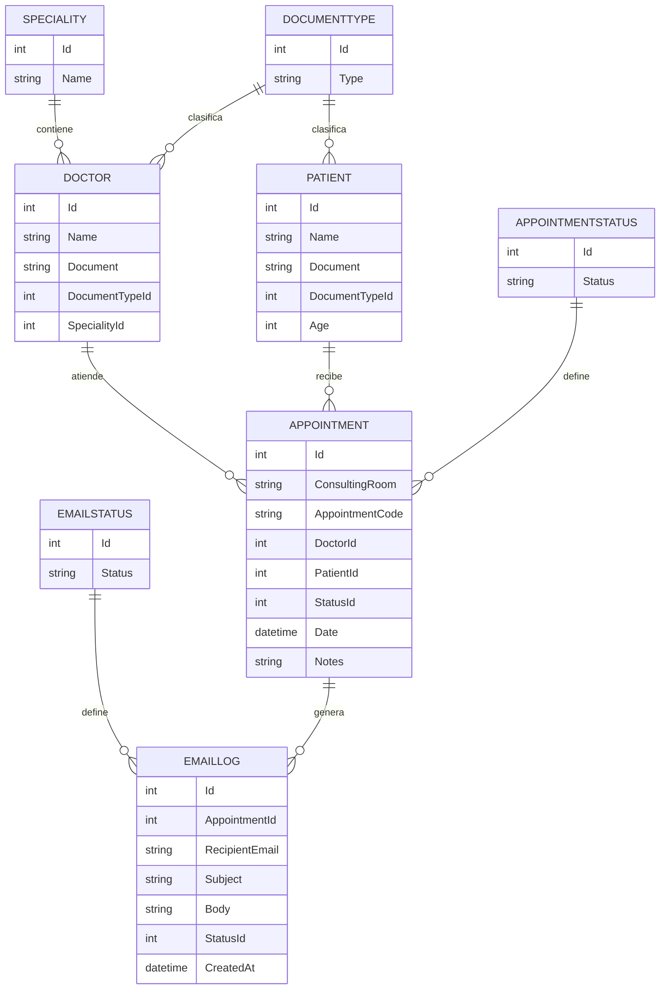

# Appointment Backend – Documentación de Base de Datos

Este documento describe la estructura de la base de datos generada mediante **Entity Framework Core (Code First)** para la aplicación **Appointment Backend**, destinada a la gestión de citas médicas.

---

## Descripción general

La base de datos administra información sobre doctores, pacientes, citas médicas, tipos de documentos, especialidades, y el envío de correos electrónicos relacionados con dichas citas.

Se utilizan las siguientes **tablas principales**:

- `Doctors`
- `Patients`
- `Appointments`
- `EmailLogs`
- `Specialities`
- `DocumentTypes`
- `AppointmentStatuses`
- `EmailStatuses`

---

## Entidades y sus atributos

### ️ Doctor
Hereda de `Person`.

| Campo | Tipo | Descripción |
|-------|------|-------------|
| Id | int (PK) | Identificador único |
| Name | string | Nombre completo |
| Document | string | Documento único del doctor |
| DocumentTypeId | int (FK) | Tipo de documento |
| Phone | string | Teléfono |
| Email | string | Correo electrónico |
| SpecialityId | int (FK) | Especialidad médica |
| Appointments | ICollection<Appointment> | Citas asociadas |


**Relaciones:**
- `Doctor` → `Speciality` (muchos a uno)
- `Doctor` → `DocumentType` (muchos a uno)
- `Doctor` → `Appointments` (uno a muchos)

---

### Patient
Hereda de `Person`.

| Campo | Tipo | Descripción |
|-------|------|-------------|
| Id | int (PK) | Identificador único |
| Name | string | Nombre completo |
| Document | string | Documento único del paciente |
| DocumentTypeId | int (FK) | Tipo de documento |
| Phone | string | Teléfono |
| Email | string | Correo electrónico |
| Age | int | Edad |
| Appointments | ICollection<Appointment> | Citas asociadas |

**Relaciones:**
- `Patient` → `DocumentType` (muchos a uno)
- `Patient` → `Appointments` (uno a muchos)

---

### Appointment

| Campo | Tipo | Descripción |
|-------|------|-------------|
| Id | int (PK) | Identificador de cita |
| ConsultingRoom | string | Consultorio asignado |
| AppointmentCode | string | Código único generado automáticamente |
| DoctorId | int (FK) | Doctor asignado |
| PatientId | int (FK) | Paciente asignado |
| Date | DateTime | Fecha y hora de la cita |
| StatusId | int (FK) | Estado de la cita |
| Notes | string | Notas adicionales |

En la tabla no veo la relacion con EMailLogs aunque se menciona abajo

**Relaciones:**
- `Appointment` → `Doctor` (muchos a uno)
- `Appointment` → `Patient` (muchos a uno)
- `Appointment` → `AppointmentStatus` (muchos a uno)
- `Appointment` → `EmailLogs` (uno a muchos, inversa desde `EmailLog`)

---

### EmailLog

| Campo | Tipo | Descripción |
|-------|------|-------------|
| Id | int (PK) | Identificador único |
| AppointmentId | int (FK) | Cita relacionada |
| RecipientEmail | string | Correo destinatario |
| Subject | string | Asunto del correo |
| Body | string | Contenido del correo |
| StatusId | int (FK) | Estado del correo |
| CreatedAt | DateTime | Fecha de creación |

**Relaciones:**
- `EmailLog` → `Appointment` (muchos a uno)
- `EmailLog` → `EmailStatus` (muchos a uno)

---

### Speciality

| Campo | Tipo | Descripción |
|-------|------|-------------|
| Id | int (PK) | Identificador único |
| Name | string | Nombre de la especialidad |
| Doctors | List<Doctor> | Doctores asociados |

Aunque se menciona la relacion con Doctors no se hace mencion a la FK en la tabla

**Relación:**
- `Speciality` → `Doctors` (uno a muchos)

---

### DocumentType

| Campo | Tipo | Descripción |
|-------|------|-------------|
| Id | int (PK) | Identificador único |
| Type | string | Tipo de documento (CC, TI, CE, etc.) |
| Doctors | List<Doctor> | Doctores asociados |
| Patients | List<Patient> | Pacientes asociados |

Aunque se menciona la relacion con Doctors y Patients no se hace mencion a la FK en la tabla

**Relaciones:**
- `DocumentType` → `Doctors` (uno a muchos)
- `DocumentType` → `Patients` (uno a muchos)

---

###  AppointmentStatus

| Campo | Tipo | Descripción |
|-------|------|-------------|
| Id | int (PK) | Identificador |
| Status | string | Estado (Pendiente, Confirmada, Cancelada, etc.) |
| Appointments | List<Appointment> | Citas con este estado |

**Relación:**
- `AppointmentStatus` → `Appointments` (uno a muchos)

---

### EmailStatus

| Campo | Tipo | Descripción |
|-------|------|-------------|
| Id | int (PK) | Identificador |
| Status | string | Estado del correo (Enviado, Fallido, Pendiente) |
| Emails | List<EmailLog> | Correos asociados |

**Relación:**
- `EmailStatus` → `EmailLogs` (uno a muchos)

---

## Relaciones principales (resumen)

| Origen | Destino | Tipo | DeleteBehavior |
|---------|----------|------|----------------|
| Appointment → Doctor | Muchos a uno | Restrict |
| Appointment → Patient | Muchos a uno | Restrict |
| Appointment → AppointmentStatus | Muchos a uno | Restrict |
| Doctor → Speciality | Muchos a uno | Restrict |
| Doctor → DocumentType | Muchos a uno | Restrict |
| Patient → DocumentType | Muchos a uno | Restrict |
| EmailLog → Appointment | Muchos a uno | Restrict |
| EmailLog → EmailStatus | Muchos a uno | Restrict |

---

## Claves únicas

- `Doctor.Document` es único
- `Patient.Document` es único

---

## Diagrama entidad-relación (ER)



## Convenciones de configuración

- DeleteBehavior.Restrict: evita el borrado en cascada.

- OnModelCreating define todas las relaciones manualmente.

- Code First: el esquema se genera desde las clases C#.

- Herencia: Doctor y Patient derivan de Person.

## Notas técnicas

- Base de datos recomendada: MySQL/MariaDB con Pomelo Provider

- EF Core usa migraciones para mantener el esquema actualizado.

```bash
// Generar migración:

dotnet ef migrations add InitialCreate

// Actualizar base de datos:

dotnet ef database update
```